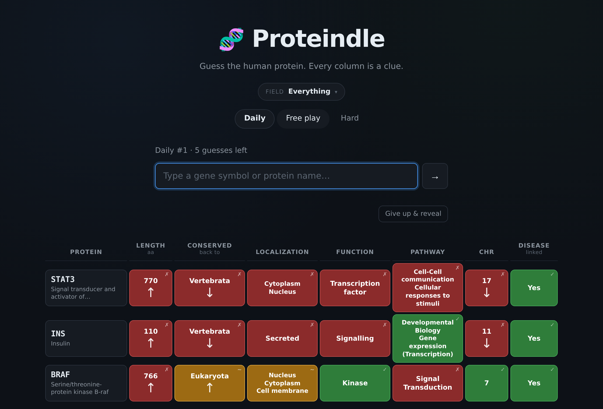

# Proteindle

Guess the human protein. Every column is a clue.

**▶ Play at [proteindle.github.io](https://proteindle.github.io)**



A daily puzzle shaped like Wordle, except the answer is one of ~3,000 human
proteins and the feedback is biology: how long it is, how far back in
evolution it goes, where in the cell it sits, what it does, which pathway it
belongs to, which chromosome it is on, and whether it is linked to disease.

Pick your field on the first visit — DNA repair, immunology, metabolism, one
of 24 — and every answer comes from it, with its own daily rotation. A
specialist gets the proteins they actually know.

No accounts, no tracking, no backend. It is a static page and a JSON file.

---

## How to play

Type any human gene symbol or protein name. Each column compares your guess
to the answer:

| | meaning |
|---|---|
| 🟩 green | exact match |
| 🟨 amber | close — it means something different per column |
| 🟥 red | no match |
| ↑ ↓ | the answer is higher / lower than your guess |

Amber is not one thing. On **Length** it means within 10%. On **Conserved
back to**, one rung away. On **Localization** and **Pathway**, the sets
overlap without being identical. On **Function**, a different class in the
same family — guess a kinase when the answer is a protease and you get
amber, because both are enzymes.

Eight guesses on the daily. Free play and Hard are unlimited, with a give-up
button and an **Easier one** button that draws from well-known proteins and
from dailies that have already run.

---

## The columns

| Column | Type | Source |
|---|---|---|
| **Length** | numeric ↑↓ | UniProt |
| **Conserved back to** | ordinal ↑↓ | Gene-Ages consensus |
| **Localization** | multi-value | UniProt subcellular location, collapsed to 9 buckets |
| **Function** | single | rules over UniProt keywords, EC number and protein name |
| **Pathway** | multi-value | Reactome, rolled up to top-level pathways |
| **Chromosome** | numeric ↑↓ | HGNC cytogenetic location |
| **Disease-linked** | boolean | UniProt disease annotations with an OMIM anchor |

### The conservation ladder

This is the column that makes the game worth playing, so it is worth being
precise about what it claims:

1. **Universal** — bacteria, archaea and eukaryotes alike
2. **Ancient** — shared with one prokaryotic domain
3. **Eukaryota**
4. **Opisthokonta** — animals and fungi; present in yeast
5. **Eumetazoa** — animals; in flies and worms, not yeast
6. **Vertebrata**
7. **Mammalia**

Gene-Ages ships eight age bins. Two of them — "shared with archaea" and
"shared with bacteria" — are **siblings, not rungs**: neither is deeper than
the other, so ordering them would make the up/down arrow lie. They are
collapsed into one "Ancient" rung, which leaves a scale that is honestly
ordinal end to end. That is the only kind an arrow can hint at.

Coverage is 19,099 of 20,190 human proteins, spread across all seven rungs
with none dominating.

---

## Fields

Fields are Reactome's top-level pathways, which sit at about the granularity
people use to describe their own work. Three rules shape the list:

- Categories nobody identifies with are dropped. "Disease" spans a third of
  the proteome; "Drug ADME" is plumbing.
- Anything under 50 members is dropped — its daily rotation would repeat too
  soon.
- Anything over 250 is capped by how well known its members are. Immune
  System has ~1,000 and Signal Transduction ~1,000; uncapped, they stop
  being a filter at all.

Field pools are drawn from all 3,000 proteins rather than the famous 365, on
the reasoning that a specialist knows the less-famous proteins in their own
area — that knowledge is what the mode exists to reward.

---

## Running it yourself

```bash
# six hand-written proteins plus synthetic filler, no download needed
python pipeline/make_fixture.py --run
python serve.py

# the real database (~400 MB of one-off downloads)
python pipeline/download.py
python pipeline/build.py
python serve.py
```

Python 3.8+ and nothing else — the pipeline is pure standard library, so
there is no virtualenv and no `pip install`. Use `serve.py` rather than
opening `index.html` directly: the page fetches its database, and browsers
block `fetch()` on `file://`.

Downloads resume. Finished sources are skipped, half-finished flat files
restart at the byte they stopped on, and UniProt resumes at the last
completed page. `--only uniprot` retries a single source; `--page-size 50`
shrinks each request on a lossy connection.

### One self-contained file

```bash
python pipeline/bundle.py     # -> web/proteindle.html
```

Inlines the CSS, JS and database into a single page. Nothing is fetched, so
this one *does* work off `file://` — mail it, or drop it on any host.

### Deploying

`.github/workflows/pages.yml` publishes `web/` to GitHub Pages on every push
to `main`. Set Settings → Pages → Source to **GitHub Actions**.

The workflow exists because branch-based Pages publishing only accepts the
repository root or a folder named `/docs`; there is no way to point it at
`web/`.

---

## Design notes

**Answers are ranked by how well known they are.** Nobody wants to guess
`ZNF493`. Every protein is ranked by how many PubMed papers cite its gene,
and the pools are cut from the top of that list: 365 for the daily (all
seven columns present), 1,000 for free play, 3,000 for hard. The build
prints the least famous protein in each tier as a sanity check.

**One entry per gene symbol.** UniProt carries several reviewed entries for
some genes — GNAS has four; CDKN2A has p16INK4a and p14ARF separately. Two
autocomplete rows both reading "NRXN1" is a coin flip the player cannot win,
so the build keeps one: fewest missing columns, then longest sequence, with
`CANONICAL_OVERRIDES` for the cases that rule gets wrong.

**The first fortnight of every rotation** is that pool's best-known
proteins, shuffled among themselves, minus a short exclusion list for the
ones whose clue row gives them away on sight. New players get a run of wins
during the window in which they decide whether to come back.

**The daily needs no server.** At build time each rotation is written into
`proteins.json` as a fixed permutation; the client computes days since the
epoch and indexes into it, so every player sees the same protein. Field
rotations are seeded from the field key with `zlib.crc32` rather than
Python's `hash()`, which is salted per process and would silently reshuffle
everyone's puzzles on each rebuild.

A determined player can read tomorrow's answer out of the JSON. Every game
in this genre can be beaten that way; it is not worth engineering around.

**Columns are measured, not assumed.** `pipeline/entropy.py` reports, per
column, how its values are spread across the pool and — more usefully — what
a guess actually tells the player: how often it comes back green, amber or
red, and how many bits that carries. `pipeline/simulate.py` plays thousands
of rounds under three strategies and reports the distribution of guesses
needed.

Read the simulator with one caveat: it holds the whole database and filters
by exact feedback signature, whereas a person has to *recall* which proteins
fit. It measures how much information the board carries, not how hard the
game feels.

---

## Tests

```bash
python pipeline/test_classify.py    # annotation rules
python pipeline/test_download.py    # retry, resume and pagination
python pipeline/test_scoring.py     # Python scoring == JS scoring
python pipeline/playtest.py         # the game itself, in a real browser
```

The comparison rules exist twice — `web/scoring.js` for the game,
`pipeline/scoring.py` for the offline analysis — and every tuning decision
comes from the Python side. `test_scoring.py` runs both over 4,000 real
protein pairs through Node and demands identical output, so the simulator
can never end up measuring a game nobody is playing.

`test_download.py` runs against a local server that deliberately misbehaves:
truncating responses mid-body, failing a page once, honouring `Range` only
on the second attempt.

---

## Credits

Built on five open databases. If you use the data, cite them rather than
this repository.

- **[UniProt](https://www.uniprot.org/)** — protein annotations. CC BY 4.0.
  The UniProt Consortium, *Nucleic Acids Research* 53:D609–D617 (2025).
  [doi:10.1093/nar/gkae1010](https://doi.org/10.1093/nar/gkae1010)
- **[Reactome](https://reactome.org/)** — pathways. CC0. Ragueneau et al.,
  *Nucleic Acids Research* (2025).
  [doi:10.1093/nar/gkaf1223](https://doi.org/10.1093/nar/gkaf1223)
- **[HGNC](https://www.genenames.org/)** — gene symbols and locations. CC0.
  Seal et al., *Nucleic Acids Research* 54:D1098–D1107 (2026).
  [doi:10.1093/nar/gkaf1229](https://doi.org/10.1093/nar/gkaf1229)
- **[NCBI Gene](https://www.ncbi.nlm.nih.gov/gene)** — publication counts
  and gene aliases. Public domain. Source: National Library of Medicine.
- **[Gene-Ages](https://github.com/marcottelab/Gene-Ages)** — conservation
  depth. MIT, © 2016 Benjamin J. Liebeskind. Liebeskind, McWhite &
  Marcotte, *Genome Biology and Evolution* 8:1812–1823 (2016).
  [doi:10.1093/gbe/evw113](https://doi.org/10.1093/gbe/evw113)

## Licence

Source code is [MIT](LICENSE).

The derived dataset at `web/data/proteins.json` is
[CC BY 4.0](https://creativecommons.org/licenses/by/4.0/), the most
restrictive of its inbound terms, inherited from UniProt. It is a modified
work — columns are bucketed, renamed, filtered and joined. Details in
[`web/data/LICENSE`](web/data/LICENSE).
